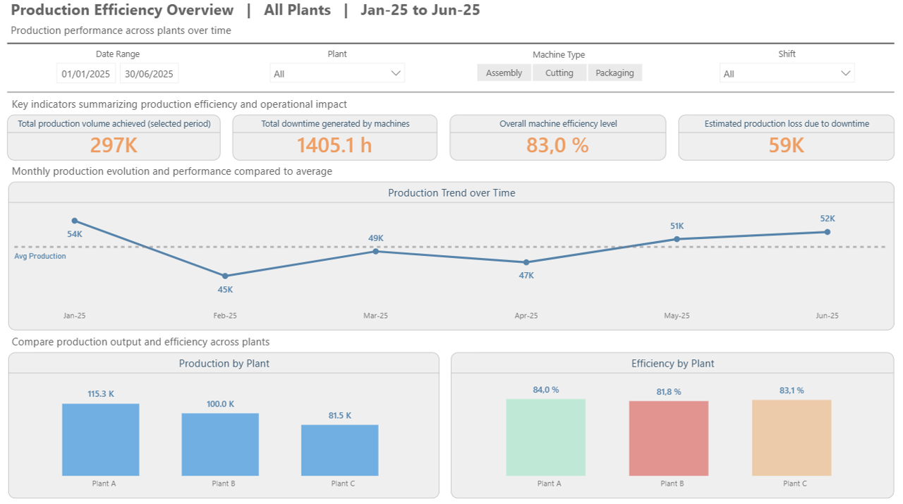
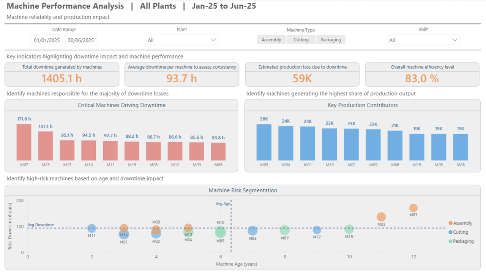
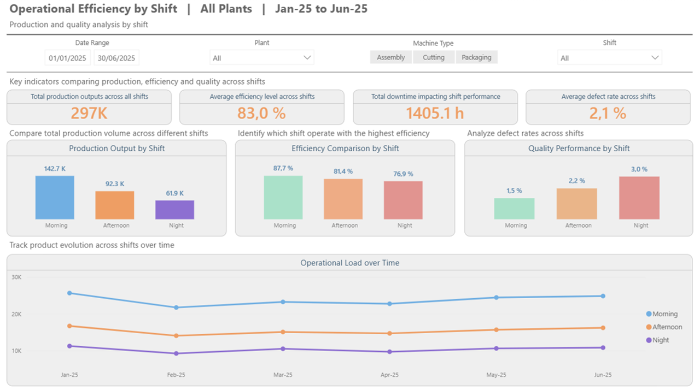
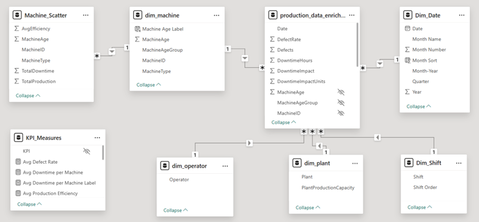

# Production Efficiency Power BI Dashboard
Industrial production efficiency dashboard built with Python, Power BI, and structured reporting logic for operational performance analysis.

## Overview
This project demonstrates how analytics can support industrial production monitoring and operational decision-making in a realistic factory environment.

The dashboard was designed to analyze production output, machine downtime, operational efficiency, and shift performance across plants and assets. The dataset was synthetically generated, validated, and enriched using Python before being modeled and visualized in Power BI.

The goal is not only to describe production activity, but to identify where performance losses are concentrated, which assets create the greatest operational pressure, and which operating conditions should be prioritized for corrective action.

## Why This Project Matters
This dashboard is designed to support operational decision-making, not just production reporting. It helps operations analysts, plant managers, and continuous improvement teams identify where output losses are concentrated, understand which machines contribute most to downtime, compare plant and shift performance, and focus improvement efforts on the areas generating the highest operational impact.

By combining production, downtime, efficiency, and quality indicators in one analytical model, the dashboard makes it easier to move from monitoring to action.

## Business Questions Addressed
This dashboard is designed to help answer key operational questions such as:

- Which plants contribute the most to total production output?
- Which machines generate the largest share of downtime and lost production?
- How does machine age relate to operational pressure and reliability risk?
- Which shift performs best in terms of output, efficiency, and quality?
- How does production performance evolve over time across the factory environment?

## Dashboard Structure

The dashboard is organized into three complementary report pages, each designed to answer a distinct operational question while remaining part of the same analytical flow.

| Page | Purpose |
|---|---|
| Production Efficiency Overview | High-level view of total production, downtime, efficiency, and plant comparison |
| Machine Performance Analysis | Machine reliability, downtime concentration, and production risk patterns |
| Operational Efficiency by Shift | Shift-level comparison of output, efficiency, quality, and operational load |

## Screenshots

### Production Efficiency Overview

This page provides the high-level summary of production performance. It is designed to help users quickly understand how output, downtime, and efficiency are distributed across plants, identify where performance pressure is concentrated, and detect which areas require closer operational review.

### Machine Performance Analysis

This page focuses on asset reliability and production impact. It helps users assess which machines contribute most to downtime, compare operational pressure across assets, and understand how equipment characteristics such as age relate to reliability and lost production.

### Operational Efficiency by Shift

This page compares operational performance across shifts. It helps users evaluate whether output, efficiency, and quality differ by operating period and whether shift-level performance patterns may explain part of the broader production results.

## Tools Used
- Power BI
- DAX
- Python
- Pandas
- GitHub

## What This Project Demonstrates Technically
This project demonstrates the ability to design a business-oriented analytics workflow from end to end. It combines Python-based data generation and validation, upstream aggregation logic, KPI design, data modeling in Power BI, and dashboard development oriented toward operational decision support.

From a technical perspective, the project shows:

- structured dataset generation for a realistic industrial use case
- sanity checks and enrichment logic in Python
- reporting-oriented aggregation design
- star schema modeling in Power BI
- KPI articulation across multiple operational dimensions
- dashboard storytelling for plant, machine, and shift analysis

## Business Context and Objective

<strong>See more</strong>

  
This project was designed as an industrial performance dashboard for a production environment where operations teams need to monitor output, efficiency, downtime, and reliability across plants, machines, and shifts.

The objective is to support operational monitoring through three complementary lenses: production output, equipment performance, and shift efficiency.

### Target Audience
- Operations analysts
- Plant managers
- Industrial performance teams
- Continuous improvement managers
- Production supervisors

### Analytical Scope
The dashboard covers five complementary dimensions of industrial performance:
- production output
- machine downtime
- efficiency
- quality by shift
- operational trends over time

## Dashboard Navigation and Cross-Page Analysis

<strong>See more</strong>

  
The report is designed as a connected analytical workflow rather than a set of isolated pages. Each page addresses a different operational question, while shared filters preserve the same analytical scope across the dashboard.

Users can begin with a high-level production view, move to machine-level performance analysis, and then assess shift-level efficiency without losing context.

### How the Pages Connect
- Production Efficiency Overview provides the overall picture of output, downtime, efficiency, and plant comparison
- Machine Performance Analysis focuses on reliability, downtime concentration, and the operational impact of specific assets
- Operational Efficiency by Shift compares how production performance changes across shifts and over time

Together, these pages support a progression from monitoring to diagnosis:
- Production Efficiency Overview identifies where performance pressure is concentrated
- Machine Performance Analysis explains which assets contribute most to downtime and lost output
- Operational Efficiency by Shift helps determine whether operating conditions differ across teams or time windows

### Shared Filters Across Pages
The dashboard uses shared slicers to maintain a consistent operational perimeter across pages.

Common filters may include:
- plant
- machine
- shift
- date or month
- risk or performance segment

When a user applies a filter on one page, that context is preserved while navigating to the others. As a result:
- visuals remain aligned on the same subset of operational data
- KPI comparisons stay consistent across report pages
- users can move from summary to detail without resetting their analysis

### Example Analytical Flow
An operations manager may start on Production Efficiency Overview to isolate a plant with below-average efficiency. From there, they can move to Machine Performance Analysis to identify which machines are contributing most to downtime and lost production. They can then open Operational Efficiency by Shift to determine whether the performance gap is also linked to a specific shift pattern or operating window.

## Data Workflow

<strong>See more</strong>

  
This project follows a structured analytics workflow that moves from simulated operational records to reporting-ready analysis in Power BI:

1. Production data generation using Python
2. Data validation and sanity checks across operational fields
3. Aggregated table generation for reporting support
4. Star schema modeling in Power BI
5. KPI design and dashboard development in Power BI

This workflow reflects a realistic industrial analytics process where part of the preparation and aggregation logic happens upstream before visualization.

### How the Data Is Rebuilt
The reporting datasets used in this dashboard are rebuilt through a three-step Python workflow. The first script generates a realistic industrial production dataset, the second validates consistency rules across the generated records, and the third creates aggregated reporting tables used to support analysis and performance exploration.

This approach makes the project reproducible and shows how raw simulated data can be turned into structured, analysis-ready inputs for industrial reporting.

### Transformation Logic
Python is used to move the project from simulated operational records to analysis-ready reporting tables. This includes generating production data, checking consistency across downtime and efficiency fields, and producing aggregation layers that support KPI interpretation in Power BI.

The transformation flow can be summarized as follows: simulated production records -> sanity checks -> aggregated reporting tables -> Power BI model -> dashboard analysis.

## KPI Logic

<strong>See more</strong>

The dashboard is built around a set of KPIs designed to connect production volume, operational efficiency, and downtime impact rather than treating them as isolated metrics.

For example:

- total production measures output generated across the selected scope,
- total downtime captures the cumulative time lost because of machine interruptions,
- average production efficiency compares achieved output against expected operating performance,
- lost production estimates the operational impact of downtime and reduced efficiency,
- shift-level indicators combine output, efficiency, and quality to compare operating performance across teams.

This KPI design helps the dashboard move from descriptive reporting to performance interpretation by linking output results to the operational conditions that influence them.

## Data Model

<strong>See more</strong>

  
The dashboard relies on a structured reporting model designed to support reliable KPI calculation and scalable filtering across the main operational dimensions of the analysis.

It links production data with entities such as plants, machines, shifts, and time, allowing the report to support both summary-level monitoring and more detailed performance investigation.

This model helps ensure:
- consistent measure definition across pages,
- efficient filtering and slicing,
- clear navigation between operational views,
- maintainable reporting logic as the analysis grows.

The diagram below illustrates the core reporting structure used to connect production records with the main business dimensions of the dashboard.

## Business Assumptions

<strong>See more</strong>

  
This project relies on a set of business assumptions designed to simulate a realistic industrial production environment. These assumptions include downtime behavior, machine age effects, efficiency measurement logic, quality variation across shifts, and plant-level performance differences.

The objective is not to reproduce a specific factory's methodology, but to demonstrate how analytical rules can be structured to support operational monitoring, anomaly detection, and performance improvement.

### Example Analytical Rule
Machine risk can be interpreted by combining downtime intensity with asset characteristics such as age. Machines with higher downtime and older profiles can then be compared against production output to identify assets that create the greatest operational pressure.

## Data Aggregation Layer

<strong>See more</strong>

  
In addition to the detailed production dataset, several aggregated tables were generated using Python to simulate upstream reporting preparation.

These tables include:

- `machine_performance.csv`
- `production_by_month.csv`
- `production_by_plant.csv`
- `shift_performance.csv`

Although these tables are not necessarily the core fact tables of the Power BI model, they demonstrate an important modeling principle: some reporting logic is often more efficient and easier to govern when it is prepared before visualization.

This strengthens the project by showing not only dashboard design, but also awareness of upstream transformation, aggregation strategy, and reporting scalability.

## Business Interpretation

<strong>See more</strong>

  
The value of the dashboard does not come only from showing production metrics, but from helping users interpret how they relate to one another. High output alone is not sufficient if it is associated with elevated downtime or lower efficiency. By connecting production, downtime, efficiency, quality, and asset characteristics, the dashboard supports a more complete reading of operational performance.

## Key Insights

<strong>See more</strong>

The analysis is designed to highlight where production pressure, downtime concentration, and efficiency loss intersect across the simulated factory environment.

It helps surface insights such as:

- which plants contribute the highest share of production output
- which machines account for the largest share of downtime
- whether older assets are associated with higher operational risk
- which shifts combine stronger output with better efficiency and quality
- where operations teams may need to focus corrective action to reduce lost production

## Recommendations

<strong>See more</strong>

  
- Prioritize maintenance action on the machines contributing the most downtime and lost production
- Compare plant-level performance to identify where operational practices differ significantly
- Review shift patterns when output, efficiency, and quality do not move together
- Use machine-age and downtime relationships as an early signal for asset reliability risk
- Track production, downtime, and efficiency together rather than in isolated views

## Reproducibility

<strong>See more</strong>

  
The project can be reproduced from the Python scripts and CSV outputs included in this repository.

### Steps
1. Run `1_generate_production_data.py` to generate the base production dataset
2. Run `2_sanity_checks.py` to validate data consistency
3. Run `3_generate_tables.py` to create aggregated reporting tables
4. Open the Power BI file and connect it to the generated CSV files

### Output Files
The workflow produces and updates detailed and aggregated files, including:

- `production_data.csv`
- `production_data_enriched.csv`
- `machine_performance.csv`
- `production_by_month.csv`
- `production_by_plant.csv`
- `shift_performance.csv`

### Requirements
- Python 3.x
- pandas
- Power BI Desktop

## Skills Demonstrated
- star schema data modeling
- DAX KPI design for operational reporting
- Python-based data generation, validation, and transformation
- aggregated reporting table design
- industrial performance analysis
- dashboard storytelling for operational decision-making

## Project Structure

<strong>See more</strong>

  
- `analysis/1_generate_production_data.py` -> generates the base production dataset
- `analysis/2_sanity_checks.py` -> validates consistency across generated fields
- `analysis/3_generate_tables.py` -> creates aggregated reporting tables
- `dashboard/production-efficiency-dashboard.pbix` -> Power BI dashboard file
- `data/` -> datasets & aggregated reporting tables
- `images/data_model.png` -> data model screenshot
- `images/machine_performance.png, production_overview.png, shift_efficiency.png` -> dashboard screenshots

## Notes

<strong>See more</strong>

The data used in this project is simulated for demonstration purposes. The focus is on analytical reasoning, KPI design, transformation logic, dashboard structure, and business-oriented interpretation in a realistic industrial reporting scenario.

